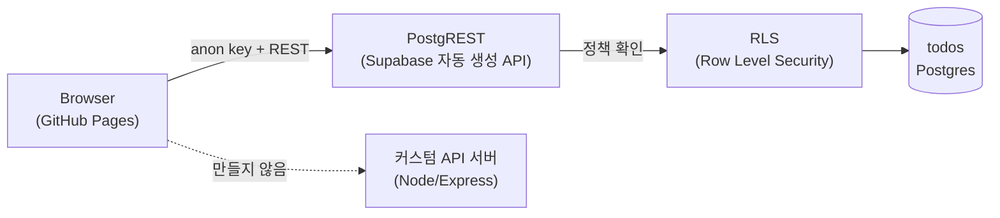

# Todo List — Supabase 백엔드 튜토리얼 (PRD)

> Status: Draft · v0.1
> Author: Lisa Park (rubilisa08)
> Date: 2026-09-06
> Repository: https://github.com/rubilisa08/to-do-list
> Live: https://rubilisa08.github.io/to-do-list/

튜토리얼을 따라 만든 백엔드가 실제로 도는 것을 손으로 확인하고, 삭제·검색을 직접 얹은 개인 프로젝트의 요구사항 정리.

## 목차

1. [개요 & 배경](#1-개요--배경)
2. [목표 & 성공 기준](#2-목표--성공-기준)
3. [사용자 & 범위](#3-사용자--범위)
4. [아키텍처](#4-아키텍처)
5. [API 전달 방식](#5-api-전달-방식)
6. [기능 명세](#6-기능-명세)
7. [보안 체크리스트](#7-보안-체크리스트)
8. [비기능 요구사항](#8-비기능-요구사항)
9. [배포](#9-배포)
10. [향후 확장](#10-향후-확장)

## 1. 개요 & 배경

이 프로젝트는 백엔드 실습 과제의 결과물이다. 목표는 하나 — **데이터가 진짜로 저장되는 앱을 손으로 만들어보는 것**. Supabase 공식 퀵스타트 튜토리얼을 따라 할 일 목록(Todo List) 앱을 만들고, 튜토리얼에 없는 기능(삭제, 검색)과 보안 체크리스트를 직접 얹었다.

이 문서는 그 과정에서 내린 아키텍처 결정 — 프론트/백엔드를 어떻게 나눌지, API를 어떻게 클라이언트에 전달할지 — 을 정리한 스펙이다.

## 2. 목표 & 성공 기준

- 브라우저에서 입력한 데이터가 새로고침 후에도, 다른 기기에서도 남아있는 것을 직접 확인한다.
- 튜토리얼을 그대로 따라하는 데 그치지 않고, 최소 하나의 기능을 스스로 설계·구현한다.
- 과제에서 요구한 5가지 보안 체크리스트를 이 프로젝트 맥락에서 실제로 점검하고 문서화한다.

| 기준 | 충족 여부 |
|---|---|
| 배포된 링크에서 실제로 항목 추가/삭제가 DB에 반영되는가 | ✓ 확인됨 |
| 튜토리얼 범위를 넘는 개선 기능이 최소 1개 이상 있는가 | ✓ 삭제 + 검색 |
| 보안 체크리스트 5항목에 대한 답이 문서화되어 있는가 | ✓ §7 |

## 3. 사용자 & 범위

**사용자:** 로그인 없이 접속하는 단일 방문자 기준의 개인용/데모용 도구. 여러 명이 같은 목록을 공유해서 보고 고치는 *공개 데모*로 범위를 한정했다 (계정별 목록 분리는 범위 밖 — §10 참고).

**범위 안**
- 할 일 추가 / 조회 / 완료 체크 / 삭제
- 키워드로 목록 검색(필터)
- 정적 사이트로 배포되어 별도 서버 운영 없이 상시 접근 가능

**범위 밖**
- 로그인 / 사용자별 데이터 분리 — 인가(authorization)가 필요 없는 공개 데모로 명시적으로 제한
- 정렬 옵션, 카테고리/태그, 마감일 등 부가 기능
- 모바일 네이티브 앱, 오프라인 지원

## 4. 아키텍처

가장 먼저 결정한 것은 **프론트엔드와 백엔드를 각자 어떻게 만들 것인가**였다. 결론은 — 백엔드를 직접 짜지 않는다. Supabase가 Postgres 위에 REST API를 자동으로 얹어주는 **PostgREST**를 내장하고 있어서, 커스텀 서버(Node/Express 등)를 만드는 건 이미 있는 걸 다시 만드는 셈이었다.



브라우저는 anon key로 Supabase의 자동 생성 REST API(PostgREST)를 직접 호출하고, 접근 제어는 RLS 정책이 담당한다. 점선으로 표시한 커스텀 API 서버 경로는 이 프로젝트에서 만들지 않은 대안이다 — Supabase가 이미 그 역할을 대신한다.

**구성 요소**

| 계층 | 구현 | 배포 위치 |
|---|---|---|
| 프론트엔드 | 정적 HTML / CSS / JavaScript (빌드 도구 없음) | GitHub Pages |
| 백엔드 API | PostgREST (Supabase 관리형, 직접 구현 없음) | Supabase 클라우드 |
| 데이터베이스 | Postgres, `todos` 테이블 1개 | Supabase 클라우드 |

> **결정:** 프론트와 백엔드는 배포 단위로는 분리되어 있다(GitHub Pages / Supabase). 다만 백엔드 로직을 직접 구현하는 대신 매니지드 서비스로 대체했다 — 이번 과제의 목적이 "백엔드가 실제로 도는 것"을 경험하는 것이었고, PostgREST + RLS 조합이 그 목적에 정확히 부합하기 때문이다.

## 5. API 전달 방식

두 번째 결정은 **API를 프론트엔드에 어떻게 전달할 것인가**였다. 직접 만든 API가 없으므로 "전달"의 실체는 두 값이다 — 프로젝트 URL과 anon(공개용) key. 이 둘을 `config.js`에 두고, `@supabase/supabase-js` 클라이언트 라이브러리가 내부적으로 REST 호출로 변환한다.

```js
// config.js — 저장소에 커밋된 공개 설정
const SUPABASE_URL = "https://mkzfolqgewlggwrcerck.supabase.co";
const SUPABASE_ANON_KEY = "sb_publishable_pU3l...";

// app.js — 라이브러리가 REST 호출을 감싸준다
const client = supabase.createClient(SUPABASE_URL, SUPABASE_ANON_KEY);
client.from("todos").select("*"); // GET /rest/v1/todos
```

**왜 이 방식인가**
- **anon key는 비밀이 아니다.** 브라우저에 노출되도록 설계된 키라, 리포지토리에 그대로 커밋해도 된다. 실제 접근 제어는 키의 비밀성이 아니라 §7의 RLS 정책이 담당한다.
- **service_role key는 절대 여기 들어가지 않는다.** 이 키는 RLS를 우회하는 관리자 권한이라, 서버 쪽 코드(Edge Function 등)에서만 써야 한다. 이 프로젝트엔 그런 서버 쪽 코드 자체가 없다.
- **버전 관리는 코드가 담당한다.** API 계약이 바뀌면(테이블 컬럼 추가 등) `setup.sql`과 `app.js`를 같은 커밋에서 함께 바꾼다 — 별도의 API 문서를 유지할 필요가 없을 만큼 계약이 얇다.

## 6. 기능 명세

**데이터 모델 — `todos`**

| 컬럼 | 타입 | 제약 |
|---|---|---|
| `id` | bigint | identity, primary key |
| `task` | text | not null, 1~200자 |
| `is_complete` | boolean | 기본값 false |
| `created_at` | timestamptz | 기본값 now() |

**기능 & API 매핑**

| 기능 | Supabase 호출 | 비고 |
|---|---|---|
| 목록 조회 | `select().order()` | 튜토리얼 기본 |
| 항목 추가 | `insert()` | 튜토리얼 기본 |
| 완료 체크 | `update().eq()` | 튜토리얼 기본 |
| 항목 삭제 | `delete().eq()` | 직접 추가 |
| 키워드 검색 | 없음 — 클라이언트 필터 | 직접 추가 · DB 재조회 없이 로컬 필터링 |

## 7. 보안 체크리스트

과제에서 제시한 5개 항목을 이 프로젝트에 그대로 적용한 결과.

| 체크 항목 | 적용 | 근거 |
|---|---|---|
| 비밀값을 코드에 안 적었는가 | 해당 없음 | anon key는 공개용으로 설계된 키. service_role key는 어디에도 사용하지 않음. |
| 검증을 백엔드에서 하는가 | 적용 | `check (char_length(trim(task)) > 0 and char_length(task) <= 200)` — API 직접 호출도 막음. |
| RLS를 켜고 정책을 넣었는가 | 적용 | `enable row level security` + anon 역할 select/insert/update/delete 정책 4개. |
| 로그인 데이터에 인가가 들어가는가 | 범위 밖 | 로그인 없는 공개 데모로 의도적 제한. 확장 방법은 §10. |
| 무료 티어 한도를 아는가 | 확인 | DB 500MB · 대역폭 5GB/월 · 카드 미등록 · 1주 비활동 시 자동 일시정지. |

## 8. 비기능 요구사항

- **가용성:** 정적 프론트는 GitHub Pages, 백엔드는 Supabase 무료 플랜 — 둘 다 별도 운영 비용 없이 상시 접근 가능해야 한다.
- **성능:** 개인 데모 규모(수십 건 이하)를 전제로 한다. 검색은 서버 재조회 없이 클라이언트 필터로 처리해 입력 지연이 없어야 한다.
- **휴면 대비:** 무료 Supabase 프로젝트는 1주 이상 비활동 시 자동 일시정지되므로, 오래 방치되면 첫 요청이 실패할 수 있다는 점을 알고 있어야 한다.

## 9. 배포

| 구성 요소 | 위치 |
|---|---|
| 소스 저장소 | https://github.com/rubilisa08/to-do-list |
| 배포된 프론트엔드 | https://rubilisa08.github.io/to-do-list/ |
| Supabase 프로젝트 | `mkzfolqgewlggwrcerck.supabase.co` |

배포 파이프라인은 없다 — `main` 브랜치에 push하면 GitHub Pages가 정적 파일을 그대로 서빙한다. DB 스키마 변경은 Supabase SQL Editor에서 수동으로 실행한다 (`setup.sql`이 실행 순서의 기록).

## 10. 향후 확장

지금 범위 밖에 둔 것들과, 실제로 확장한다면 밟을 경로.

| 확장 | 필요한 변경 |
|---|---|
| 사용자별 로그인 & 인가 | Supabase Auth 추가 → `todos`에 `user_id` 컬럼 → RLS 정책을 `using (auth.uid() = user_id)`로 교체 |
| RLS로 못 막는 복잡한 로직 | Supabase Edge Function을 얇은 커스텀 API 계층으로 추가 (예: 외부 알림 발송, 복잡한 검증) |
| 다건 데이터 대비 | 목록이 커지면 클라이언트 검색을 서버 사이드 `ilike` 쿼리로 전환 |
